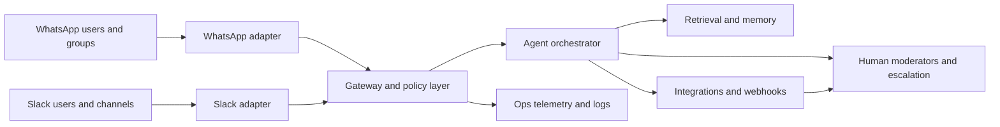
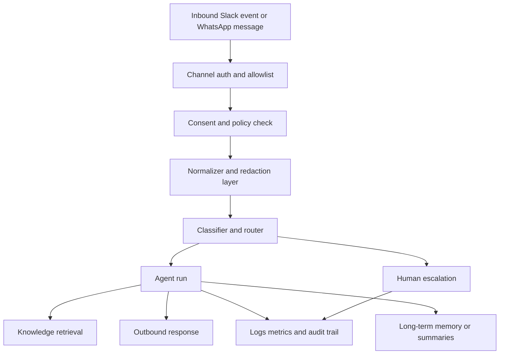
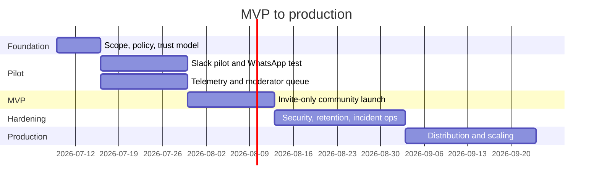

# Best Practices for Launching an OpenClaw or Hermes Community Agent for WhatsApp Groups and Slack

## Executive summary

A community-facing agent for WhatsApp groups and Slack should be designed first as a **governed communications system**, and only second as an AI product. The launch-critical work is to define what the agent is allowed to do, where it is allowed to speak, what data it may retain, who can override it, and how failures get detected and escalated. Both OpenClaw and Hermes can cover much of this stack, but they differ sharply in trust model and WhatsApp path. OpenClaw is explicitly documented as a **personal-assistant trust model**, not a hostile multi-tenant boundary, and recommends separate gateways, credentials, and ideally separate OS users or hosts for mixed-trust or adversarial users. Hermes, by contrast, documents layered gateway authorization, approval flows, container isolation, and profile isolation more explicitly for multi-user operation. citeturn35view0turn34view0turn13view4turn40view1

For **Slack**, both are viable. Hermes uses Slack Bolt and Socket Mode, with DMs responding to every message and channels responding only when @mentioned, replying in threads by default. OpenClaw supports Socket Mode or HTTP Request URLs, plus pairing, channel allowlists, App Home, interactivity, and per-channel mention gates. For a community, thread-first behavior and mention gating are strong defaults because they reduce ambient noise and make moderation and auditing easier. citeturn13view0turn9view6turn12view4turn12view5

For **WhatsApp**, the answer depends on whether you optimize for **speed and group support now** or for **official platform compliance**. OpenClaw today is “production-ready via WhatsApp Web (Baileys)” and supports group sessions, mention gating, and per-group isolation, but it is QR-linked and not the official Meta business path. Hermes has both a Baileys bridge and an official WhatsApp Business Cloud API adapter; however, Hermes’s Cloud adapter currently handles **direct messages only**, while Meta’s platform now exposes a **Groups API** with eligibility requirements such as Official Business Account status and Cloud API usage. If WhatsApp group participation is mandatory on day one, OpenClaw or Hermes’s Baileys bridge is the fastest path. If compliance, business continuity, and vendor-supported infrastructure matter more, the long-term path is the official Meta stack, with a custom Groups API adapter or a wait for native Hermes support. citeturn24view0turn13view2turn13view7turn39view0turn37search0turn37search1turn37search2turn37search3

My recommendation is a two-track decision. For a **trusted, invite-only pilot** serving one or a few curated communities, use **OpenClaw or Hermes Baileys** with a dedicated WhatsApp number, strict allowlists, mention-only group activation, and minimal tools. For a **production program** that may span multiple organizations or external Slack workspaces and needs more formal compliance posture, choose **Hermes as the operational core**, use Slack first, and either implement or plan for the official WhatsApp Groups API rather than relying permanently on QR-linked Web automation. citeturn35view0turn34view3turn24view2turn21search7turn20search0

## Platform choice and reference architecture

### When OpenClaw is the better fit

OpenClaw is unusually strong for **group-chat behavior** on messaging surfaces you already inhabit. Its WhatsApp group model supports allowlists, mention gating, and isolated per-group session keys, and its Slack integration supports DM pairing, channel allowlists by stable channel ID, native mention handling, App Home, and interactivity. It also gives you BOOT.md and workspace-driven behavior shaping, which is useful when you want the agent to carry a stable persona and operating checklist from startup onward. citeturn13view2turn9view5turn12view4turn12view5turn14search0turn16view2

The constraint is trust. OpenClaw explicitly says one gateway is meant for one trusted operator boundary, and warns that mutually untrusted users sharing a tool-enabled agent also share that delegated tool authority. That makes OpenClaw excellent for a founder-led community, a moderated fellowship, or a small private operator-run group, but a weaker default for a broad public or semi-public multi-tenant deployment unless you split gateways and credentials per community or per risk boundary. citeturn35view0turn41search18

### When Hermes is the better fit

Hermes is the better fit when you need a more explicit **ops and security envelope**. Its docs describe seven security layers including user authorization, dangerous-command approvals, container isolation, MCP credential filtering, prompt-injection scanning of context files, session isolation, and input sanitization. Profiles isolate config, API keys, memory, sessions, skills, cron jobs, and gateway state, which makes it much easier to separate a public community concierge from an internal ops or moderation worker. Hermes also ships first-class webhooks, plugins, MCP integration, and a durable Kanban board for multi-agent workflows. citeturn34view0turn40view1turn26view1turn26view2turn26view3turn27view0

Hermes also has the stronger official WhatsApp story because it offers a production-grade integration with Meta’s WhatsApp Business Cloud API, including public HTTPS webhook requirements and the 24-hour customer-service-window caveat. The limitation today is that Hermes’s Cloud adapter handles DMs only, while Meta’s platform has moved forward with Groups API support under eligibility constraints. That makes Hermes the stronger long-term foundation, but not quite the simplest official answer for WhatsApp groups today. citeturn13view7turn39view0turn37search0turn37search1

### Recommended default architecture

For most teams, the most robust architecture is:

The key architectural decision is to keep a **single policy and routing layer** between channels and the model. That layer should handle identity mapping, allowlists, mention gating, rate limiting, webhooks, tool policy, and escalation before the agent ever sees the message. This is the right place to normalize Slack user IDs, WhatsApp sender IDs, group IDs, consent state, and channel-specific reply rules. It is also where you reduce risk by stripping or quarantining large attachments, external URLs, and untrusted documents before passing content onward. Hermes’s webhook adapter and OpenClaw’s webhooks plugin both reinforce this pattern, and OpenClaw’s security docs explicitly advise denying sensitive control-plane tools such as `gateway`, `cron`, `sessions_spawn`, and `sessions_send` for agents handling untrusted content. citeturn26view1turn26view0turn35view1

For a public or multi-community deployment, do **not** run one all-powerful agent with terminal and config mutation exposed to every surface. In Hermes, use separate profiles and a container backend for production. In OpenClaw, split trust boundaries across separate gateways or hosts. citeturn34view1turn34view3turn35view0

## Essential decisions before launch

The shortlist below is the practical core. If these are not nailed down, the launch is not ready.

| Priority | Essential item | Rationale | Concrete next steps | Responsible roles | Effort and complexity |
|---|---|---|---|---|---|
| P0 | **Choose the trust model** | OpenClaw is not positioned as a hostile multi-tenant boundary, while Hermes is more explicit about layered controls. This decision shapes whether you can safely serve one curated community, many unrelated communities, or the general public. citeturn35view0turn34view0 | Decide: single trusted community, multi-community, or cross-workspace/public. If OpenClaw and mixed trust, split gateways and credentials per boundary. If Hermes, split profiles and tokens by function and audience. | Product lead, platform lead, security lead | Medium effort, very high consequence |
| P0 | **Pick the WhatsApp path** | OpenClaw uses WhatsApp Web via Baileys and QR login; Hermes supports both Baileys and the official Cloud API. Hermes Cloud is DM-only today; Meta’s official Groups API exists but has eligibility requirements. citeturn24view0turn24view2turn13view7turn39view0turn37search0turn37search1 | Choose one of three paths: fast pilot on Baileys, official DM-first Cloud API, or custom official Groups API integration. Use a dedicated phone number in every case. | Product lead, platform lead, legal/privacy lead | High effort, high consequence |
| P0 | **Define narrow agent scope** | The more tasks the agent can do, the more moderation, privacy, and security surface you create. Slack and WhatsApp support very different UX patterns, and WhatsApp’s outside-window messaging rules can break delayed notifications. citeturn13view7turn39view0 | Write a one-page scope charter with “does”, “does not”, and “escalates to human”. Start with FAQ, lightweight routing, limited notifications, and moderator assist. Defer autonomous moderation sanctions and sensitive workflows. | Product lead, community ops, moderator lead | Small effort, high leverage |
| P0 | **Lock channel reply rules** | Slack thread-first, mention-gated behavior is quieter; OpenClaw and Hermes both support gating. OpenClaw WhatsApp group activation can be `mention` or `always`; `mention` is far safer for launch. citeturn13view0turn13view2turn12view4 | Set Slack channel replies to @mention-only in threads. Set WhatsApp group activation to mention-only. Keep DMs open only for opted-in or paired users. Document visible vs silent behavior. | Community ops, platform lead | Small effort, high leverage |
| P0 | **Design data minimization and retention** | OpenClaw separates workspace memory from credential state and recommends keeping `MEMORY.md` only in the main private session, not shared/group contexts. Hermes stores sessions in SQLite with full histories, memories in `MEMORY.md` and `USER.md`, and per-profile state. GDPR requires purpose limitation, minimization, privacy by design, and appropriate security. citeturn16view2turn16view0turn40view0turn9view3turn31search1turn31search2turn31search4 | Define what is stored: message text, metadata, attachments, summaries, moderator notes. Set retention for raw transcripts vs summaries. Exclude sensitive fields by default. Add deletion/export process before launch. | Privacy lead, data lead, legal counsel, platform lead | Medium effort, very high consequence |
| P0 | **Set human escalation paths** | High-stakes or ambiguous moderation and user safety issues should not rest on model output alone. NIST’s current incident response framing emphasizes detect, respond, recover, and improvement loops. citeturn33view0 | Create severity ladder: content issue, harassment, impersonation, legal complaint, suspected compromise, harmful advice. Map each severity to responder, SLA, channel, and evidence requirements. | Community ops, trust and safety, security lead | Medium effort, very high leverage |
| P1 | **Ship observability before automation** | OpenClaw supports Prometheus and OpenTelemetry exporters; Hermes has dashboard, logs, and session storage. If you cannot see the agent’s rate of intervention, latency, top intents, and failure modes, you will tune blindly. citeturn22search6turn25search3turn19search1turn40view0 | Instrument message volume, response latency, non-response rate, escalation rate, moderation flags, webhook failures, Slack install failures, WhatsApp delivery failures, and template-window failures. | Platform lead, data lead | Medium effort, high leverage |
| P1 | **Harden tool and integration blast radius** | Hermes warns against running production gateways on local host backends and recommends container or remote isolation. OpenClaw advises denying sensitive tools for untrusted surfaces. OWASP flags prompt injection, insecure plugin design, sensitive data disclosure, and excessive agency as top LLM risks. citeturn34view1turn35view1turn33view1 | Start with retrieval, messaging, and webhook tools only. Disable terminal, config mutation, cron creation, and session-spawn for public-facing agents. Add tools only after abuse review. | Security lead, platform lead | Medium effort, very high consequence |
| P1 | **Prepare distribution and installation UX** | Slack multi-workspace installs require OAuth and secure installation storage; commercial distribution and non-Marketplace installs now carry policy and rate-limit implications. WhatsApp opt-in must clearly identify the business and comply with law. citeturn28view1turn20search4turn28view4turn29view0turn29view1turn18search2 | Decide whether Slack stays internal to one workspace or is distributed across many. If distributed, implement OAuth, state verification, installation store, and post-install landing page. For WhatsApp, create clear opt-in text and deep links where applicable. | Product lead, platform lead, legal/privacy lead | Medium effort, high consequence |

### The minimum viable launch scope

For launch, the safest scope is:

1. **Q&A and routing**
   - answer FAQs from a curated knowledge base
   - point people to docs, links, moderators, and channels
   - summarize thread context on request

2. **Moderator assist, not autonomous punishment**
   - flag probable issues
   - suggest responses
   - create escalation summaries
   - never auto-ban, auto-remove, or auto-report externally on day one without human confirmation

3. **Notifications with hard limits**
   - only in cases with explicit user opt-in or channel policy approval
   - direct-delivery for machine-generated alerts where possible, not an LLM-generated full run every time
   - on WhatsApp, design around the 24-hour window and template requirements for out-of-window messaging on official APIs. citeturn26view1turn18search7turn13view7

## Experience design, capabilities, data flow, and onboarding

### Goals and scope

A good community agent should have one dominant job. The most robust framing is: **reduce friction, not replace humans**. That means three primary goals:

- answer common questions quickly
- keep channels organized and less repetitive
- route edge cases to the right human or workflow

That framing aligns with the platform ergonomics. Hermes on Slack is already thread-first after mentions, which naturally suits “clarify, route, summarize” behavior in communities. OpenClaw’s WhatsApp groups are also mention-gated by default, which keeps it from becoming noisy in social group chats. citeturn13view0turn13view2

The launch anti-pattern is a vaguely defined “community manager AI” with moderation, operations, workflows, and outreach all bundled together. That usually creates tone inconsistency, data over-collection, and unclear accountability. Split roles early: one **community-facing concierge**, one **moderator assist worker**, and optionally one **ops notifier**. Hermes profiles and Kanban make this natural; OpenClaw’s separate gateways and workspaces make it possible but more operationally manual. citeturn40view1turn27view0turn35view0

### Persona and tone

Both frameworks let you shape voice through context files. OpenClaw’s `SOUL.md` is explicitly where the agent’s voice lives and is injected into sessions; Hermes likewise uses a global `SOUL.md` per profile and facts in `USER.md` and `MEMORY.md`. In practice, this means your persona should be versioned, reviewed, and tested like product copy, not improvised in a single launch prompt. citeturn6search8turn10search20turn9view3turn40view1

The best tone for community contexts is usually:
- concise
- warm but non-clingy
- explicit about uncertainty
- humble on moderation and policy
- thread-first and suggestive, not dominating

Avoid “omnipresent assistant” tone, especially in WhatsApp groups. In public groups, the bot should feel like a helpful librarian or triage coordinator, not the loudest person in the room. OpenClaw’s `mention` activation mode and Hermes’s channel @mention behavior reinforce this naturally and should remain the default. citeturn13view2turn13view0

### Functional capabilities

The launch capability set should be channel-specific.

For **Slack**, prioritize:
- Q&A from a vetted knowledge base
- thread summaries
- moderator shortcuts and escalation buttons using interactivity
- workflow triggers for support, onboarding, and incident alerts
- channel-scoped notifications
- App Home as a “how to use me” surface plus policies and status. Slack’s APIs support Events, interactivity, OAuth installs, and custom workflow steps; Hermes and OpenClaw both expose Slack adapters built around these primitives. citeturn28view2turn28view3turn28view1turn9view6turn11view2

For **WhatsApp**, prioritize:
- FAQ and quick guidance
- private follow-up in DMs where appropriate
- group mention-only responses
- narrowly defined notifications
- opt-in onboarding and help text

On official Meta APIs, message windows and template requirements make WhatsApp a worse fit for arbitrary delayed notifications than Slack. Meta’s platform also now distinguishes standard messaging from group messaging via the Groups API, and Groups API behavior and pricing differ from the normal customer-service window mechanics. citeturn18search7turn37search2turn37search3turn37search4

For **integrations**, keep the first version boring:
- knowledge base or docs store
- ticketing/help-desk intake
- CRM/member directory if needed
- event/webhook sources
- moderation queue destination

Hermes’s webhook adapter can validate HMAC signatures and either invoke the agent or do direct delivery with `deliver_only`, which is excellent for alerts and low-latency notifications. OpenClaw’s webhooks plugin similarly gives authenticated HTTP routes for trusted external systems. citeturn26view1turn26view0

### Data flows and storage

A safe default data flow is:

In storage design, think in layers:

- **raw transcripts**
- **derived summaries**
- **durable memory**
- **audit and metrics**
- **credentials and secrets**

OpenClaw clearly separates workspace memory from gateway config and credentials. Its workspace contains `AGENTS.md`, `SOUL.md`, `USER.md`, daily `memory/YYYY-MM-DD.md`, optional `MEMORY.md`, and optional `BOOT.md`; credentials and sessions live under `~/.openclaw/`, and its builtin memory index uses SQLite by default. OpenClaw also explicitly recommends loading `MEMORY.md` only in the main private session, not in shared/group contexts. citeturn16view2turn41search0turn6search18turn41search1

Hermes stores full session history and metadata in `~/.hermes/state.db`, while `MEMORY.md` and `USER.md` live in `~/.hermes/memories/`. Profiles give you clean state isolation per agent, which is ideal for separating community-facing memory from internal ops memory. citeturn40view0turn9view3turn40view1

The design rule is simple: **retain the least sensitive representation that still solves the product problem**. Usually that means shorter-lived raw transcripts, longer-lived sanitized summaries, and very selective durable memory. GDPR’s purpose limitation, minimization, transparency, privacy-by-design, and security-of-processing principles all point in that direction. citeturn31search4turn31search1turn31search2

### Onboarding and opt-in UX

For **Slack**, there are two distinct onboarding flows:

- **internal single-workspace install**  
  Use an app manifest, install to the workspace, enable the Messages tab, invite the bot to selected channels, and start with @mention-only threads. Hermes can generate a Slack manifest; OpenClaw supports pairing in DMs and channel allowlists keyed by stable Slack channel ID. citeturn11view2turn12view4turn12view5turn9view6

- **multi-workspace distribution**  
  You need OAuth, state verification, secure installation storage, and a clear post-install landing page. Slack’s docs are explicit that multi-workspace installs require OAuth, and Marketplace guidance requires a public landing page, privacy policy, and support channel if you distribute at scale. New non-Marketplace commercial apps also face stricter rate limits on conversation history and replies. citeturn28view1turn20search4turn28view5turn28view4turn29view0

For **WhatsApp**, use explicit opt-in language even when the platform path is less formal. Meta’s opt-in guidance says businesses must clearly identify the business users are opting in to, and must comply with applicable law. Meta also supports in-app signup and opt-in deep links. On official Cloud API and Groups API paths, you additionally need valid webhook infrastructure and, for groups, eligibility such as Official Business Account status. citeturn18search2turn18search3turn18search15turn37search0turn37search1

If you use OpenClaw or Hermes Baileys for pilots, still behave like a compliant business system:
- dedicated number
- no bulk or spam behavior
- no outreach to users who have not engaged first
- QR-link only on a managed device
- invite-only groups until moderation is proven. Hermes’s Baileys guidance explicitly recommends a dedicated number and warns against automating outbound messages to people who have not messaged first. OpenClaw likewise recommends a two-phone setup and warns against linking your personal WhatsApp. citeturn11view1turn15view2

## Governance, privacy, compliance, and security

### Monitoring, metrics, and feedback loops

You need product metrics, safety metrics, and infrastructure metrics from day one.

At minimum, track:
- messages received by channel and room
- response latency
- response rate and intentional silence rate
- “resolved without human” rate
- escalation rate
- moderation-flag rate
- install/onboarding conversion
- opt-in conversion for WhatsApp
- webhook failures
- Slack OAuth/install failures
- WhatsApp delivery failures and 24-hour-window failures
- top unanswered questions
- user satisfaction signals

OpenClaw has official Prometheus and OpenTelemetry diagnostics exporters, readiness/liveness probes, startup trace hooks, and JSONL logging. Hermes has session persistence, rotating logs, dashboard-based monitoring, and slash/debug tools. Together, this is enough to instrument an operationally serious system without inventing your own telemetry model. citeturn22search6turn25search3turn19search5turn19search2turn41search3turn25search4turn19search1turn40view0

The most valuable feedback loop is not a thumbs-up button. It is a **moderator review queue** with sampled transcripts tagged by issue type: hallucination, tone miss, policy miss, false moderation flag, missed escalation, privacy concern, and uncovered FAQ. That queue should drive weekly prompt/policy updates and monthly backlog changes. This is partly inference from the operational surfaces above, but it is strongly aligned with NIST’s emphasis on continuous improvement in incident and risk handling. citeturn33view0

### Governance and moderation policy

Community agents should not merge “moderation” into one undifferentiated power. Separate it into four functions:

- **detect**
- **label**
- **intervene softly**
- **escalate**

Launch with the first three and keep hard sanctions human-controlled. Slack interactivity and workflow steps are useful here because they let moderators approve actions from within Slack. WhatsApp is weaker for rich moderation UX, so it is often better as a detection and redirection surface than as the place where moderation decisions are finalized. citeturn28view2turn28view3

Your moderation policy should explicitly define:
- prohibited behaviors and examples
- what the bot may say publicly vs privately
- what the bot may never do autonomously
- when a human moderator must review
- evidence retention rules
- appeals path

For OpenClaw, keep `/reasoning`, `/verbose`, and `/trace` disabled in public rooms because they may expose internal reasoning, tool outputs, URLs, and diagnostics. For Hermes, keep `display.tool_progress` conservative in messaging contexts and retain production approval prompts for dangerous actions. citeturn35view1turn25search2turn25search21

### Legal and privacy baseline

If personal data are processed, the launch checklist should include at least:

- identified controller and processors
- a lawful basis per processing purpose
- an Article 13-style transparency notice
- retention and deletion rules
- data-subject request path
- security measures
- processor agreements where needed
- cross-border transfer review where applicable
- DPIA when risk is likely high

The legal basis must be chosen **per purpose**, not waved through as “legitimate interests” by default. EDPB guidance says Article 6(1)(f) requires a documented three-part assessment, and should not be treated as an open-ended fallback. GDPR also requires privacy by design and by default, and security of processing. EDPB has additionally published a DPIA template to help structure high-risk assessments. citeturn32view2turn31search1turn31search2turn32view0

For Slack specifically, this is stricter than many teams realize. Slack’s developer-policy update says apps may not collect, store, or use data without proper consent and may not use Slack data to train an LLM under any circumstances. Marketplace guidance also requires a clear privacy policy describing what data is collected, how it is used, how long it is kept, and how users can request access, transfer, or deletion. citeturn29view1turn28view5

For WhatsApp, Meta’s opt-in documentation requires clear business identification and compliance with applicable law, and official webhook endpoints require valid TLS certificates, with self-signed certificates disallowed. Meta also supports mTLS on webhooks for added security. citeturn18search2turn18search1turn18search8

### Security model, early mitigations, later hardening, and incident response

The early threat model should assume:
- prompt injection via inbound messages, docs, or links
- account/token compromise
- over-permissioned tools
- noisy or malicious group participants
- data leakage through logs or tool previews
- webhook forgery or replay
- SSRF and internal URL access
- unsafe automation and “too much agency”

That maps directly to OWASP’s LLM risks such as prompt injection, insecure output handling, sensitive information disclosure, insecure plugin design, and excessive agency. citeturn33view1

**Early mitigations for MVP**
- strict allowlists and pairing
- mention-gated group behavior
- minimal tool surface
- no host terminal for public-facing agents
- secrets only in protected env/config files
- signed webhooks and request verification
- replay-window checks for HTTP ingress
- separate bot identities and phone numbers
- conservative logging and redaction
- no automatic sanctions
- one-click human escalation path

These measures are all directly supported by the docs: Hermes defaults to deny without allowlists or pairing and recommends container backends in production; OpenClaw recommends allowlists, has a security audit, authenticates gateway access by default, and warns against exposing sensitive tooling to untrusted content. Slack signs incoming requests and recommends timestamp checks to mitigate replay; Meta requires TLS for webhook endpoints. citeturn13view4turn34view3turn34view1turn35view0turn35view1turn35view2turn28view0turn18search1

**Later hardening for production**
- container or remote sandbox for all agent execution
- per-function profiles or gateways
- website/domain blocklists and SSRF protections
- OpenTelemetry plus Prometheus
- token rotation and key inventory
- IP allowlisting where relevant
- Marketplace and formal app review paths for Slack distribution
- WhatsApp template and Groups API operational readiness on official paths
- regular audit of tool permissions, logs, and escalation quality

Hermes already ships SSRF protections, website blocklists, container security flags, credential filtering, and context-file prompt-injection scanning. OpenClaw ships security audit tools, OTEL/Prometheus exporters, authenticated gateway defaults, and explicit guidance to split mixed-trust use across separate gateways and hosts. Slack also supports IP allowlisting for Web API calls and requires HTTPS/TLS 1.2+ for the platform. citeturn34view2turn34view3turn35view0turn25search3turn22search6turn21search3turn21search18turn21search22

**Incident response**
Use a simple detect, respond, recover, improve loop:
- detect via alerts, logs, user reports, and anomaly thresholds
- respond by freezing risky automations, revoking tokens, and routing to incident owners
- recover through controlled restart, credential rotation, and validation tests
- improve through postmortem and policy changes

NIST’s revised incident-response framing emphasizes Detect, Respond, Recover, and explicit continuous improvement. OpenClaw and Hermes both expose enough operational controls to support this if you define the runbook before launch. citeturn33view0

## Safe self-bootstrap with the checklist

Yes, the agent can partially bootstrap itself **by processing this checklist**, but only if you treat that as a **read-only or draft-generating control loop**, not as full autonomous configuration management. The safe pattern is to let the agent inspect configuration, compare against a launch checklist, and produce a structured status report plus proposed changes, while requiring human approval for any persistent mutations. That is both safer and better operationally, because it makes the checklist executable without turning the bot into its own unreviewed administrator. citeturn14search0turn13view5turn13view6

OpenClaw has a built-in `BOOT.md` pattern: if enabled, the bundled `boot-md` hook runs startup instructions from `BOOT.md` once per workspace every gateway start. Hermes documents an equivalent community pattern where a `BOOT.md` file is executed via a gateway startup hook. Both are ideal for converting a launch checklist into a periodic operational audit. citeturn14search0turn13view5

The **safe method** is:

1. put the checklist in `BOOT.md` or `LAUNCH_CHECKLIST.md`
2. run it under a dedicated **ops profile/agent**
3. give that profile **read-only** or near-read-only capabilities
4. forbid direct production mutations by default
5. emit a structured report to an admin Slack thread or an ops file
6. require explicit human approval for any change
7. return a silent token when nothing needs attention

For OpenClaw, explicitly deny `gateway`, `cron`, `sessions_spawn`, and `sessions_send` on any checklist-processing agent that handles untrusted content, and keep startup tasks short. For Hermes, use manual approvals, a container backend, and reviewed hook scripts only, because shell hooks run with full user credentials. citeturn35view1turn13view6turn34view3

A good status schema is:

- `PASS`
- `WARN`
- `FAIL`
- `UNKNOWN`
- evidence
- recommended action
- owner
- due date

That turns the checklist into a living ops surface rather than a one-time document. It also keeps the agent in an advisory role, which is the right posture for launch.

## Roadmap and launch checklists

### Recommended roadmap

| Phase | Timebox | Outcome | Key deliverables | Exit criteria |
|---|---|---|---|---|
| Discovery and policy | Week 1 | Clear operating boundary | Scope charter, trust model, moderation policy, data map, retention policy, escalation matrix | Leadership signs off on what the agent may and may not do |
| Technical pilot | Weeks 2 to 3 | Controlled prototype in one Slack workspace and one WhatsApp test path | Dedicated identities, channel config, allowlists, knowledge base, telemetry baseline, review queue | End-to-end tests pass and moderators can escalate from the tool |
| MVP launch | Weeks 4 to 6 | Invite-only launch to one real community | Mention-gated bot, thread-first Slack behavior, group rules, FAQ coverage, incident runbook, privacy notice | Stable latency, low failure rate, escalation functioning, acceptable tone and accuracy |
| Hardening | Weeks 7 to 10 | Production-readiness | Container isolation, dashboards, alerting, token rotation, retention jobs, DSAR process, installation UX improvements | Security review completed, rollback tested, rotation and recovery tested |
| Production expansion | Weeks 11+ | Multi-community or multi-workspace scale | OAuth install flow for Slack, external support page, policy docs, official WhatsApp path roadmap, analytics loop | Distribution and compliance posture no longer depend on manual founder operations |

A compact milestone view:

### Recommended tools, libraries, and official sources

For **OpenClaw**, use the official channel and diagnostics surfaces first: Slack channel docs, WhatsApp channel docs, `BOOT.md`, `@openclaw/diagnostics-prometheus`, and `@openclaw/diagnostics-otel`. These are the cleanest supported paths for channel behavior and observability. citeturn9view6turn24view0turn14search0turn22search2turn25search0

For **Hermes**, use the built-in Slack adapter, the Messaging Gateway docs, the official WhatsApp Cloud guide when you need Meta’s supported path, plugins for custom tools, MCP for external systems, webhooks for event-driven flows, and Kanban if you need durable multi-agent workflows. citeturn11view2turn9view2turn13view7turn26view2turn26view3turn26view1turn27view0

For **Slack**, prefer official SDKs and platform surfaces:
- `slack-bolt` and `slack_sdk`
- OAuth installation flow
- request signing verification
- interactivity
- workflow steps
- Events API. Hermes’s own Slack adapter explicitly uses `slack-bolt` and `slack_sdk`. citeturn11view2turn28view1turn28view0turn28view2turn28view3turn20search15

For **WhatsApp**, use Meta’s official docs for:
- Cloud API
- webhooks and TLS
- opt-in
- in-app signup and deep links
- Groups API if you pursue official group support. citeturn36search20turn18search1turn18search2turn18search3turn37search0turn37search1turn37search2turn37search3

### Launch-day checklist

- freeze prompt, policy, and scope changes 24 hours before launch
- verify Slack installs, channel invites, and App Home/help text
- verify WhatsApp number, opt-in text, group mention behavior, and fallback help message
- test one moderator escalation on each channel
- confirm logs, metrics, alerts, and incident contacts
- confirm privacy notice and support contact are live
- rotate any temporary tokens used during setup
- run one final abuse test: prompt injection, spam mention, bad attachment, forged webhook, replayed Slack request. Slack request verification and Meta TLS requirements are non-optional. citeturn28view0turn18search1

### Post-launch checklist

- review the first 50 to 100 interactions manually
- tag failure modes and add missing FAQs
- inspect all escalations for false positives and false negatives
- prune unnecessary retained data
- review tool permissions again after real usage
- publish a short community-facing changelog so expectations stay aligned
- decide whether to expand scope only after data, not intuition

## Open questions and limitations

Some important details remain deployment-specific and should not be guessed:

- **jurisdiction**: local telecom, consumer-protection, labor, child-safety, and ePrivacy or anti-spam rules may materially change the legal basis, notices, and retention requirements
- **WhatsApp official group strategy**: Meta’s Groups API is now documented, but Hermes’s Cloud adapter is still DM-only in v1, and OpenClaw’s WhatsApp path is WhatsApp Web based rather than Meta Cloud API. If official WhatsApp groups are mandatory, adapter roadmap becomes a core engineering choice, not a detail. citeturn37search0turn37search1turn39view0turn24view0
- **distribution model**: if the Slack app is intended for many external workspaces or commercial distribution, OAuth, Marketplace posture, privacy policy, and rate-limit planning become much more important. citeturn28view1turn28view4turn29view0turn28view5
- **tool blast radius**: if you intend to allow code execution, shell access, or config mutation from community channels, the security posture must be significantly stricter than the baseline advice in this report. Hermes and OpenClaw both document safer alternatives and stronger isolation models, and those should be treated as requirements rather than enhancements in that case. citeturn34view1turn35view1

The highest-confidence conclusion is this: if you want a launch that survives real use, do not begin with “what can the model do?” Begin with **who can trigger it, where it can speak, what it may store, what it may never do, and how a human takes over**. The frameworks are already good enough to support that. The risk is usually not missing capability. It is missing boundaries.